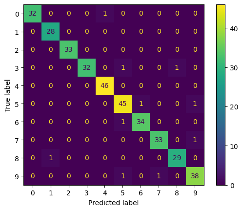

```{python}
#| echo: false

import json
from pathlib import Path

results_path = Path("../outputs/classification_results.json")

with open(results_path, "r", encoding="utf-8") as f:
    results = json.load(f)

accuracy = results["accuracy"]
precision = results["precision"]
recall = results["recall"]
f1 = results["f1"]
```

# Executive Summary

This report summarizes the performance of a multiclass digit classification model.

# Overall Metrics

```{python}
#| echo: false

import pandas as pd

metrics_df = pd.DataFrame(
    {
        "Metric": [
            "Accuracy",
            "Precision",
            "Recall",
            "F1 Score",
        ],
        "Value": [
            accuracy,
            precision,
            recall,
            f1,
        ],
    }
)

display(metrics_df)
```

# Key Findings

```{python}
#| echo: false

if f1 >= 0.95:
    print(
        "The model demonstrates strong overall performance "
        "with only a small number of misclassifications."
    )
elif f1 >= 0.85:
    print(
        "The model performs well overall, though there are "
        "noticeable classification errors."
    )
else:
    print(
        "The model would benefit from additional tuning "
        "and failure analysis."
    )
```

# Confusion Matrix



# Per-Class Metrics

```{python}
#| echo: false

import pandas as pd

per_class = pd.DataFrame(results["per_class_report"]).T

digit_rows = [
    idx for idx in per_class.index
    if str(idx).isdigit()
]

display(
    per_class.loc[
        digit_rows,
        ["precision", "recall", "f1-score", "support"]
    ].round(3)
)
```

# Evidently AI Diagnostics

A detailed interactive report was generated at:

`outputs/evidently_classification_report.html`

# Conclusion

This evaluation demonstrates that:

- The model achieves strong overall classification performance.
- Confusion matrix analysis reveals specific class-level mistakes.
- Aggregate metrics alone do not fully capture model behavior.
- Automated reporting combines quantitative metrics and qualitative insights.
